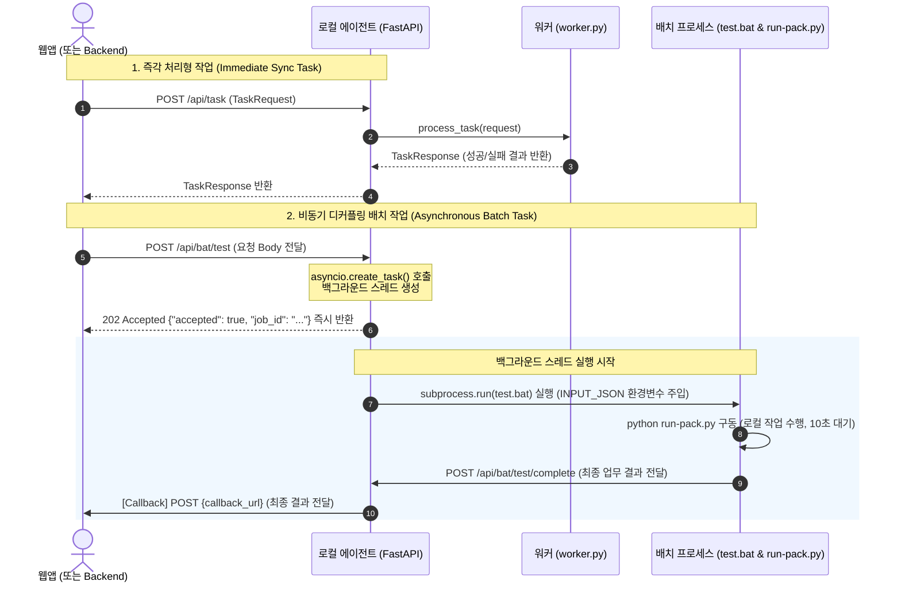

# 로컬 에이전트 서비스 템플릿 아키텍처 및 상세 기능 분석 가이드

본 문서는 로컬 PC에서 실행되어 웹 기반 원격 서비스와 상호작용하는 **로컬 에이전트 서비스 템플릿(Local Agent Service Template)**의 전체적인 아키텍처 구조와 설계 패턴, 그리고 코드베이스 내 모든 클래스 및 함수의 작동 원리를 라인 바이 라인 수준으로 상세히 분석한 기술 문서입니다.

---

## 1. 전체 개요 및 역할 (Overview & Role)

### 1.1. 로컬 에이전트의 정의와 중요성
현대 웹 애플리케이션(SaaS, 원격 백엔드)은 브라우저의 보안 샌드박스 정책(Same-Origin Policy, 하드웨어 접근 제한)으로 인해 사용자의 로컬 PC에 직접 액세스할 수 없습니다. 
로컬 PC 내부의 장치 제어, 시스템 메트릭 수집, 대용량 파일 가공, 외부 프로세스(예: Windows Batch 파일, C++ 실행 파일) 실행 등의 비즈니스 요구사항을 달성하기 위해 **웹앱과 로컬 OS 사이를 중계하는 경량 프록시 서버(Agent)**가 필요합니다.

### 1.2. 본 템플릿 에이전트의 핵심 역할
이 프로젝트는 완성형 에이전트 서비스를 빠르게 구현할 수 있도록 설계된 표준 템플릿입니다. 주요 역할은 다음과 같습니다.
1. **REST API 중계**: 원격 또는 로컬 웹앱으로부터 HTTP 요청을 수신하여 로컬 로직(`worker.py`)을 구동하고 결과를 즉시 또는 비동기로 반환합니다.
2. **시스템 트레이 통합**: 백그라운드 서비스로 상주하며 사용자가 트레이 메뉴를 통해 상태를 모니터링하고 제어할 수 있도록 GUI 인터페이스를 제공합니다.
3. **디커플링된 백그라운드 배치 처리**: 즉각적인 응답이 불가능한 무거운 작업(10초 이상 소요)을 위해, 별도의 독립 프로세스(Windows Batch 및 Python Pack Runner)를 실행하고 작업이 끝나면 콜백을 통해 비동기적으로 결과를 보고하는 비동기 파이프라인을 지원합니다.
4. **실시간 로그 모니터링**: 에이전트 내부에서 발생하는 모든 이벤트를 락(Lock) 메커니즘이 보장된 인메모리 버퍼와 일별 파일에 동시 기록하며, 이를 브라우저를 통해 실시간 웹 로그 뷰어 페이지로 조회할 수 있도록 합니다.

---

## 2. 적용 기술 및 아키텍처 구조 (Tech Stack & Architecture)

### 2.1. 기술 스택 (Technology Stack)
* **Core Framework**: `FastAPI` (Python의 초고속 비동기 웹 프레임워크, ASGI 기반)
* **ASGI Web Server**: `Uvicorn` (비동기 처리를 위한 싱글 스레드 이벤트 루프 기반 서버)
* **Data Validation & Serialization**: `Pydantic v2` (타입 안전성 보장 및 Swagger OpenAPI 스펙 자동화)
* **System Tray GUI**: `pystray` (Windows/macOS 호환 트레이 아이콘 관리 도구)
* **Image Processing**: `Pillow (PIL)` (메모리 상에서 실시간으로 상태별 트레이 아이콘 그리기)
* **Asynchronous Client**: `httpx` (비동기 HTTP 요청 처리로 결과 전송 시 블로킹 방지)
* **Process Execution**: `subprocess` (독립된 OS 레벨 프로세스 실행)

---

### 2.2. 프로세스 및 스레딩 아키텍처
에이전트는 2개의 레이어로 스레드와 프로세스를 완전히 분리하여 UI 응답성을 유지하고 무거운 작업으로 인해 서버가 중단되는 현상을 방지합니다.

```mermaid
graph TD
    subgraph Main Process (tray_app.py)
        A[Main Thread: pystray GUI Event Loop] <-->|Start / Status Control| B[Daemon Thread: Uvicorn Server]
        B -->|Async API Router| C[FastAPI App: server.py]
    end

    subgraph Logging Layer (log_manager.py)
        C -->|Log Event| D[Thread-safe Logger]
        D -->|Append| E[In-memory Log Buffer: deque]
        D -->|Write| F[Daily Log File: *.log]
    end

    subgraph Business Logic Layer (worker.py)
        C -->|Immediate Task| G[worker.process_task]
        G -->|Dummy / Custom Logic| H[Return JSON Response]
    end

    subgraph External Decoupled Process
        C -->|Background Task Trigger| I[asyncio.create_task]
        I -->|Thread Pool: asyncio.to_thread| J[subprocess.run cmd.exe]
        J -->|Spawn Process| K[test.bat]
        K -->|Execute| L[run-pack.py: Pack Runner]
        L -->|POST Complete API| C
    end
```

#### A. 스레딩 구조 (GUI & Server 분리)
* **메인 스레드 (Main Thread)**: `pystray` 이벤트 루프가 장악합니다. OS의 시스템 트레이 메시지 루프를 감시하며 클릭 이벤트를 처리합니다. 이 루프는 블로킹 방식으로 작동합니다.
* **백그라운드 데몬 스레드 (Daemon Thread)**: `Uvicorn` 서버가 실행됩니다. 메인 스레드가 완전히 종료되면 데몬의 특성상 서버도 강제로 자동 정리되도록 설계되어 있습니다.

#### B. 비동기 백그라운드 실행 구조
* 사용자가 배치 작업(`POST /api/bat/test`)을 요청하면, FastAPI는 이를 받아 즉시 "요청되었습니다"(`job_id` 포함)를 응답하여 클라이언트를 기다리게 하지 않습니다.
* 실제 처리는 `asyncio.create_task`를 사용하여 서버의 메인 비동기 루프 뒤로 넘깁니다. 
* OS 레벨의 배치를 실행하는 `subprocess.run`은 동기식(Blocking)으로 동작하므로, 비동기 서버 전체가 멈추는 것을 방지하기 위해 `asyncio.to_thread`를 사용하여 별도의 스레드 풀에서 안전하게 비동기식으로 실행합니다.

---

### 2.3. 데이터 및 배치 작업 흐름도



---

## 3. 코드 구조 및 파일별 구성 (Directory Structure)

```
c:\source\local-agent-template\
│  config.py                    # 중앙 설정 파일 (앱 이름, 포트, 로깅 경로 등)
│  log_manager.py               # 실시간 로그 버퍼링 및 다중 핸들러 초기화
│  main.py                      # 개발/디버깅용 터미널 모드 엔트리포인트
│  models.py                    # Pydantic 기반 API Request/Response 데이터 모델
│  requirements.txt             # 의존성 패키지 명세
│  server.py                    # FastAPI 라우터 및 미들웨어, Embedded HTML 뷰어
│  tray_app.py                  # pystray 및 Pillow를 활용한 시스템 트레이 GUI 엔트리포인트
│  worker.py                    # 실질적인 로컬 비즈니스 로직 처리기 (커스터마이징 포인트)
├─pack_runner/                  # 분리된 백그라운드 외부 프로세스 폴더
│  │  run-pack.py               # 외부 프로세스용 Python 메인 실행 파일
│  │  test-pack.json            # 배치에서 구동할 작업 리스트 및 설명서
│  │  test.bat                  # 외부 구동용 Windows 배치 스크립트 파일
│  └─router/
│      │  route.py              # 외부 프로세스 내부에서 실제 Task들을 로드하고 가공 및 콜백하는 Router 클래스
```

---

## 4. 상세 함수 레퍼런스 (Detailed Function & Class Reference)

모든 소스 파일의 최상단 모듈 로직부터 클래스, 내부 함수, 파라미터, 구현 내용의 작동 원리와 목적을 상세히 설명합니다.

### 4.1. `config.py` — 중앙 설정 관리

설정값을 단일 모듈에서 전역 상수로 관리하는 모듈입니다. 에이전트의 전체 이름, 네트워크 주소, 로그 경로 등을 규정합니다.

#### 1) `get_log_dir() -> Path`
* **매개변수 (Parameters)**: 없음
* **반환값 (Return Value)**: `Path` (로그 디렉토리 절대 경로 객체)
* **내부 동작 방식**:
  1. 현재 구동 환경의 운영체제가 Windows(`sys.platform == "win32"`)인지 확인합니다.
  2. Windows인 경우 시스템 환경변수 `%LOCALAPPDATA%`를 조회하여 없을 경우 사용자 홈 디렉토리(`Path.home()`)를 기본 경로로 잡고 `LocalAgent/logs` 경로를 결합합니다.
  3. Windows가 아닌 운영체제(macOS, Linux)의 경우 사용자 홈 디렉토리에 숨김 폴더인 `.local-agent/logs` 형태로 생성합니다.
  4. `log_dir.mkdir(parents=True, exist_ok=True)`를 실행하여 상위 폴더를 포함해 로그 폴더가 실재하도록 강제 생성합니다.
* **설계적 의미와 목적**: 운영체제별 표준화된 애플리케이션 데이터 영역에 로그를 유실 없이 쓰기 위한 경로 동적 생성 헬퍼 함수입니다.

---

### 4.2. `log_manager.py` — 실시간 로그 관리 모듈

표준 `logging` 라이브러리의 핸들러 파이프라인 구조를 확장하여 파일, 표준 출력(Console), 그리고 **웹 화면 조회를 위한 인메모리 버퍼**에 로그를 실시간 분배합니다.

#### 1) 전역 객체 설명
* `MAX_LOG_ENTRIES = 500`: 인메모리 데크(deque)의 최대 원소 개수 제한선입니다. 500개가 넘으면 오래된 로그부터 자동 폐기(FIFO)되어 메모리 누수를 방지합니다.
* `_log_buffer = deque(maxlen=500)`: 로그 딕셔너리를 보관하는 고정 크기 인메모리 링 버퍼입니다.
* `_lock = threading.Lock()`: 스레드 동기화 객체입니다. 로컬 에이전트는 멀티스레드 환경(GUI 스레드, 백엔드 서버 스레드, 백그라운드 태스크 스레드)이므로, 동시에 덮어쓰기나 메모리 꼬임이 일어나지 않도록 보호하는 락입니다.
* `_log_counter = 0`: 생성되는 로그에 1씩 증가하는 유일 무이한 정수 ID 값을 바인딩하여 뷰어 브라우저가 "마지막으로 받아간 ID 이후의 새 로그만 주세요(after_id)" 요청을 처리할 수 있게 돕습니다.

#### 2) `class BufferHandler(logging.Handler)`
Python의 `logging.Handler`를 상속하여 커스텀 로깅 저장소로 기능하게 하는 클래스입니다.
* **`emit(self, record: logging.LogRecord)`**:
  * **매개변수**: `record` (`logging.LogRecord` 객체 - 로그 발생 시점의 레벨, 모듈명, 가공되지 않은 메시지 등 정보 포함)
  * **내부 동작 방식**:
    1. 전역 카운터인 `_log_counter`를 사용하기 위해 `global _log_counter`를 선언합니다.
    2. `with _lock:` 구문을 통해 타 스레드의 접근을 차단합니다.
    3. `_log_counter`를 1 증가시킵니다.
    4. `datetime.now()`를 활용해 밀리초 단위까지 포함된 정밀한 시간 포맷 문자열(`%H:%M:%S.%f`에서 끝 3자리 절삭)을 생성합니다.
    5. 시간, 로그 레벨(INFO/WARNING/ERROR), 모듈 정보(로거 이름), 포맷팅이 적용 완료된 실제 메시지(`record.getMessage()`)를 키-값 딕셔너리로 조립해 `_log_buffer`에 `append`합니다.
    6. 이 핸들러 자체에서 예외(`Exception`)가 터지더라도 본 업무 흐름을 차단해서는 안 되므로 `except Exception: pass` 처리로 예외를 봉쇄합니다.
  * **설계적 의미와 목적**: 애플리케이션의 핵심 비즈니스 로직에 전혀 부담을 주지 않으면서 생성된 모든 로깅 이벤트를 캡처하여 인메모리에 박제하는 역할을 수행합니다.

#### 3) `get_logs(after_id: int = 0, level: Optional[str] = None) -> List[dict]`
* **매개변수**: 
  * `after_id` (`int`, 기본값 `0`): 클라이언트 브라우저가 특정 ID 이후의 정보만 걸러서 요청하기 위해 전달하는 필터 조건값입니다.
  * `level` (`Optional[str]`, 기본값 `None`): 특정 로그 레벨만 골라내기 위한 필터 문자열입니다.
* **반환값**: 필터링 조건에 부합하는 로그 딕셔너리 객체 리스트
* **내부 동작 방식**:
  1. `with _lock:`을 사용해 조회가 수행되는 찰나에 다른 스레드가 버퍼를 훼손하지 못하도록 방어막을 칩니다.
  2. `_log_buffer`를 복제해 순수한 `list`로 캐스팅합니다.
  3. `after_id`보다 큰 `id`값을 가지는 항목만 리스트 컴프리헨션을 적용하여 거릅니다.
  4. 만약 `level` 파라미터가 유효하게 넘어왔다면 대문자로 치환한 뒤 일치하는 항목만 추출합니다.
* **설계적 의미와 목적**: HTTP GET API에 연결되어 브라우저에서 대역폭 낭비 없이 실시간으로 추가되는 새 로그만 콕 집어 가져갈 수 있도록 지원(폴링 최적화)합니다.

#### 4) `clear_logs()`
* **매개변수**: 없음
* **반환값**: 없음
* **내부 동작 방식**: `with _lock:` 내부에서 `_log_buffer.clear()`를 호출하여 데크의 모든 캐시 데이터를 즉시 초기화합니다.
* **설계적 의미와 목적**: 로그 뷰어 화면의 "Clear" 버튼 기능 구현용 내부 청소 함수입니다.

#### 5) `setup_logging()`
* **매개변수**: 없음
* **반환값**: 없음
* **내부 동작 방식**:
  1. `config.LOG_DIR` 디렉토리 아래에 당일 일자 파일 형식(`agent_YYYYMMDD.log`)의 물리 파일 명칭을 정의합니다.
  2. `logging.getLogger()`를 통해 전체 루트(Root) 로거 인스턴스를 확보하고 기본 레벨을 `logging.INFO`로 지정합니다.
  3. `root.handlers.clear()`를 사용하여 혹시 이미 붙어 있을 수 있는 중복 핸들러들을 깔끔히 걷어냅니다.
  4. `config.LOG_FORMAT` 구조를 따르는 공용 `Formatter`를 생성합니다.
  5. **1번 핸들러: FileHandler**를 생성해 일별 파일에 로그를 인코딩 UTF-8 규격으로 영구 저장하도록 붙입니다.
  6. **2번 핸들러: StreamHandler**를 생성해 IDE나 CLI 터미널 창에 로그가 선명히 출력되도록 `sys.stdout` 스트림으로 구성하여 붙입니다.
  7. **3번 핸들러: BufferHandler**를 자체 인스턴스화하여 메모리 버퍼 적재용으로 로거에 탑재합니다.
* **설계적 의미와 목적**: 다중 핸들러 아키텍처를 단 한 번의 호출로 깔끔히 구성하여 애플리케이션 시작 단계(main/tray_app)에서 호출하기 위함입니다.

---

### 4.3. `models.py` — Pydantic 데이터 모델

클라이언트와 에이전트 간 주고받는 모든 데이터 구조를 명시합니다. 런타임 값 검증 및 자동 명세서 출력을 책임집니다.

#### 1) `class HealthResponse(BaseModel)`
* **용도**: `GET /` 호출 시 반환되는 서버 메트릭
* **필드 구성**:
  * `service` (`str`): 에이전트명
  * `status` (`str`): 서비스 가용성 상태 ("running")
  * `version` (`str`): 빌드 버전
  * `uptime_seconds` (`float`): 기동 이후 누적 실행 초
* **구현 특이사항**: OpenAPI 문서 시각화를 돕는 예시 데이터 셋(`json_schema_extra`)이 탑재되어 있습니다.

#### 2) `class TaskRequest(BaseModel)`
* **용도**: 로컬 업무 실행을 요청하는 입력을 담는 그릇
* **필드 구성**:
  * `task_type` (`str`): 업무 구분값 (예: 'process', 'analyze')
  * `input_data` (`Any`): 구조적 제약이 없는 입력 데이터의 원본
  * `options` (`Optional[dict]`, 기본값 `None`): 페이징 한계나 언어 설정 등을 담기 위한 key-value 옵션 딕셔너리

#### 3) `class ResultItem(BaseModel)`
* **용도**: 가공 완료된 개별 업무 항목의 최소 단위 구조
* **필드 구성**:
  * `id` (`int`): 정렬된 순번
  * `value` (`str`): 실질적 연산/추출 텍스트
  * `score` (`Optional[float]`): 점수나 정확도 가중치
  * `metadata` (`Optional[dict]`): 세부 실행시간이나 타임스탬프 등의 자유형 추가 메타 데이터

#### 4) `class TaskResponse(BaseModel)`
* **용도**: 업무 완료 후 최종 결과를 일괄 반환하기 위한 종합 스키마
* **필드 구성**:
  * `success` (`bool`): 전체 작업 성공 여부 플래그
  * `task_type` (`str`): 처리된 실제 업무 구분
  * `total_count` (`int`): 결과 리스트의 총 아이템 개수
  * `results` (`List[ResultItem]`): 처리된 정적 항목들 목록
  * `elapsed_ms` (`float`): 처리 속도 벤치마킹 (밀리초 단위 실수)
  * `error` (`Optional[str]`, 기본값 `None`): 예외 상황 시 구체적인 Python Traceback 요약 문자열
  * `timestamp` (`str`): `datetime.now().isoformat()`을 람다 함수로 지연 로드하여 최종 응답 생성 시점의 표준 ISO 8601 문자를 주입

---

### 4.4. `worker.py` — 실제 작업 비즈니스 로직

에이전트가 로컬 PC에서 실질적으로 수행할 기능을 작성하는 개발자 전용 커스터마이즈 파일입니다. 현재 버전은 비동기 작업에 대응하기 위한 더미 처리 구조를 가지고 있습니다.

#### 1) `async def initialize()`
* **매개변수**: 없음
* **반환값**: 없음
* **내부 동작 방식**:
  1. 로그 모듈에 워커 초기화 시작 메시지를 기록합니다.
  2. 실제 비즈니스 환경이라면 이곳에서 브라우저(Playwright, Selenium), 데이터베이스 커넥션 풀링, 머신러닝 라이브러리 가중치 텐서 파일 로드 등의 작업을 실행해야 합니다.
  3. `await asyncio.sleep(0.5)`를 넣어 준비 시간이 필요한 로직을 흉내 냅니다.
  4. 초기화가 끝나면 `[OK]` 로깅을 띄웁니다.
* **설계적 의미와 목적**: 서버 구동 직전(Startup Event) 무겁고 오랜 동작이 필요한 자원 결합을 비동기식으로 보장하기 위한 훅입니다.

#### 2) `async def cleanup()`
* **매개변수**: 없음
* **반환값**: 없음
* **내부 동작 방식**:
  1. 서버가 정리되는 시점(Shutdown Event)에 호출되어 자원 폐기를 시작한다고 남깁니다.
  2. 띄워진 브라우저 백그라운드 인스턴스를 닫거나 DB 커넥션을 부드럽게 반환(Graceful Shutdown)하는 코드가 위치할 곳입니다.
* **설계적 의미와 목적**: 자원 유실과 메모리 누수 및 오프라인 좀비 커넥션이 남아 컴퓨터가 느려지는 현상을 사전 예방하는 생명주기 관리 정리 코드입니다.

#### 3) `async def process_task(request: TaskRequest) -> TaskResponse`
* **매개변수**: `request` (`TaskRequest` - 호출자가 FastAPI를 통해 넘겨준 인풋 모델)
* **반환값**: `TaskResponse` (결과를 팩킹한 응답 모델)
* **내부 동작 방식**:
  1. 함수가 구동되는 즉시 `time.time()`으로 정밀 소요 시간 카운트를 개시합니다.
  2. `request.input_data`를 확인하여 딕셔너리에 `items` 키가 들어 있는 구조인지, 통째로 리스트 구조인지, 혹은 단일 구조인지를 판단하여 처리 배열인 `items` 리스트로 규격화합니다.
  3. `request.options` 딕셔너리에 기재된 `max_count` 옵션을 분석하여 처리 대상 리스트 슬라이싱 범위를 강제 조율합니다.
  4. 실제 로컬 가공 로직인 `_dummy_process` 비동기 함수에 대상 리스트와 태스크 타입을 전달하여 결과를 수급(`await`)합니다.
  5. 끝난 시각을 계산하여 `elapsed_ms`에 밀리초 단위를 산출해 줍니다.
  6. 가공 성공 팩키지 형태로 `TaskResponse`를 조립 및 서명하여 리턴합니다.
  7. 만약 전체 가공 중 의기치 않은 심각한 에러(Exception)가 잡히면, `logger.error`에 전체 오류 경로를 로깅 처리하고 `success=False` 상태에 오류 내용(`str(e)`)을 바인딩해 돌려줍니다. (이렇게 하여 서버 프로세스 전체가 비명횡사하는 상황을 막습니다.)
* **설계적 의미와 목적**: 인풋 유효성 검사, 에러 제어(Fault-Tolerance), 성능 측정을 총 망라하는 메인 비즈니스 연동 컨트롤러입니다.

#### 4) `async def _dummy_process(items: list, task_type: str) -> List[ResultItem]`
* **매개변수**: 
  * `items` (`list`): 가공할 타겟 데이터 리스트
  * `task_type` (`str`): 작업 테마 종류
* **반환값**: `List[ResultItem]` (가공 완료된 목록)
* **내부 동작 방식**:
  1. 반환할 리스트 `results`를 비어있는 배열로 할당합니다.
  2. 데이터 배열을 `enumerate(..., start=1)` 루프로 돌려 순번(`i`)을 잡습니다.
  3. 실제 데이터 조작 및 크롤링 시간 딜레이를 모방하기 위해 `await asyncio.sleep(0.1)` 호출로 비동기 일시 대기 루틴을 수행합니다.
  4. `ResultItem`을 빌더 형태로 선언하여 결과 순서 값, 가공 처리 확인 문장, 무작위로 추출한 신뢰 점수(`random.uniform(0.5, 1.0)`를 소수점 3자리 수로 다듬은 값) 및 현재 가공 타임스탬프 메타데이터를 밀어 넣습니다.
  5. 배열에 추가 후 루프를 다 완료한 최종 목록을 상위 함수로 던집니다.
* **설계적 의미와 목적**: 고성능 업무를 가상화하여 시뮬레이션할 수 있게 보조하는 워크로드 데모 함수입니다.

---

### 4.5. `server.py` — FastAPI 웹 서버 컨트롤러

에이전트의 중심 인터페이스이며, 외부 세계(웹앱, OS 스크립트)와의 HTTP 소통 허브 역할 및 로깅 HTML 문서를 서빙하는 등 실질적 코어 컨트롤 센터를 지탱합니다.

#### 1) 전역 객체 설명
* `app = FastAPI(...)`: FastAPI 애플리케이션 싱글톤 객체입니다.
* `_start_time`: 웹 서버가 기동 완료된 시점의 타임스탬프로 서버의 가동 시간(Uptime) 계산의 기준점이 됩니다.
* `_LOG_VIEWER_HTML`: 별도의 정적 파일 배포 번거로움을 줄이기 위해, 순수 Python 멀티라인 스트링으로 HTML/CSS/VanillaJS를 완전 내장(Embedded)하고 있는 로그 뷰어 UI 명세 리소스입니다.

#### 2) 미들웨어(Middleware) 동작 분석
* **`CORSMiddleware`**:
  * **목적**: 웹 브라우저가 보장하는 보안 규칙인 CORS를 바이패스하여 로컬 서버 포트로 통신 가능하도록 만듭니다.
  * **동작**: `config.CORS_ORIGINS`에 등록된 오리진(기본값 `*`로 통일)에 대해 사전 요청(Preflight) 헤더 승인을 내려줍니다.
* **`private_network_access(request: Request, call_next)`**:
  * **목적**: 원격 퍼블릭 HTTPS 사이트에서 로컬 PC 사설망 호스트(127.0.0.1)로 데이터를 쏘는 경우 브라우저 레벨에서 발생하는 경고 및 접속 차단을 사전 방지하는 특별 프리플라이트 대응 헤더인 `Access-Control-Allow-Private-Network: true`를 강제 삽입해 주는 브릿지 미들웨어입니다.
* **`log_requests(request: Request, call_next)`**:
  * **목적**: 들어오는 실시간 API 호출 기록을 가로채서 소요 시간과 함께 로깅합니다.
  * **특이점**: 만약 웹 로그 뷰어 페이지 자체에서 호출하는 실시간 로그 수급용 경로(`/logs`)로 유입된 요청인 경우, 로깅 대상에서 강제로 빼주어 0.5초마다 발생하는 무한 자기 로깅 순환 참조 늪(Infinite Self-Logging Stack Overflow)을 차단합니다.

#### 3) 생명주기 이벤트 핸들러 (Lifecycle Handlers)
* **`on_startup()`**:
  * **동작**: 시작 시점을 기재하고, 콘솔에 가용 API 리스트와 로그 뷰어 URL 위치를 안내 출력하며, 상호 독립된 비즈니스 부서인 `worker.initialize()` 비동기 초기화 셋업을 강제로 방아쇠 당깁니다.
* **`on_shutdown()`**:
  * **동작**: 에이전트 서비스 다운그레이드 절차로서 `worker.cleanup()` 비동기 자원 반납 절차를 가이드하고 정지 로그를 남깁니다.

#### 4) API 라우터 함수 상세
* **`health_check()`** [`GET /`]
  * **목적**: 에이전트 생존 유무 점검용
  * **반환값**: `HealthResponse` (상태값, 버전, 업타임 제공)
* **`execute_task(request: TaskRequest)`** [`POST /api/task`]
  * **목적**: 실시간 일괄 연산 동기 처리
  * **동작**:
    1. 비즈니스 코어 `worker.process_task(request)`를 가동하여 결과를 `await`로 지켜보고 가져옵니다.
    2. 연산에 최종 성공하고 `config.REMOTE_SERVER_URL` 전송 상수값이 세팅되어 있다면 원격 백엔드로 최종 응답값 스키마를 가로채 전송해 주는 `_send_result_to_remote(response)` 비동기 헬퍼 함수를 트리거 해줍니다.
    3. 호출자에게 가공된 응답 객체를 되돌려 줍니다.
* **`run_test()`** [`GET /api/test`]
  * **목적**: 빠른 동작 확인을 위해 모의 임의 인풋값으로 가상 작업 테스트 발사
  * **동작**: 내부적으로 `task_type="test"` 요청을 담은 `TaskRequest` 임시 모델을 프로그래밍 방식으로 조립하여 `worker.process_task`를 직격 실행시킵니다.
* **`run_test_bat_get(request: Request)`** [`GET /api/bat/test`] & **`run_test_bat_post(...)`** [`POST /api/bat/test`]
  * **목적**: 시간이 아주 오래 걸려 웹소켓이나 롱폴링을 쓰기 곤란한 무거운 배치 인스턴스 작업을 비동기로 가동
  * **동작**:
    1. `uuid.uuid4()` 고유 작업 번호(`job_id`)를 발급하고 콜백 타겟 경로를 셋업합니다.
    2. **핵심**: `asyncio.create_task(_run_test_bat_background(payload))`를 호출하여 메인 비동기 루프에 배치 작업을 완전히 분리하여 예약 등록합니다.
    3. 결과가 언제 나올지 기다리지 않고 즉시 `{"accepted": true, "message": "요청되었습니다.", "job_id": "..."}`을 리턴하여 1초 이내로 클라이언트 화면 접속을 완료시킵니다.
* **`complete_test_bat(payload: dict)`** [`POST /api/bat/test/complete`]
  * **목적**: 백그라운드로 쫓겨나 돌고 돌던 배치 프로세스가 끝났을 때 에이전트에 작업 완료를 알리는 회수(Ingress) 통로
  * **동작**: 수신한 완료 JSON 객체를 타겟 콜백 주소(`config.TEST_CALLBACK_URL`)로 밀어서 전달 완료해 주는 `_send_bat_completion_to_sample(payload)` 비동기 함수를 구동하고, 최종 중계 결과를 반환합니다.
* **`get_sample()`** [`GET /api/task/sample`]
  * **목적**: 신규 연동 개발자가 API 요청 형태를 직관적으로 이해할 수 있도록 예제 데이터 모양을 응답해 줍니다.
* **`get_log_entries(after_id, level)`** [`GET /logs/entries`]
  * **목적**: 로그 뷰어 UI로 보내줄 실시간 데이터 가이드
  * **동작**: `log_manager.get_logs`에서 조건에 맞춰 파싱된 데이터를 리스트 구조로 내보냅니다.
* **`clear_logs()`** [`DELETE /logs`]
  * **목적**: 인메모리 로그 리스트 전체 소거
  * **동작**: `log_manager.clear_logs()`를 수행합니다.
* **`log_viewer_page()`** [`GET /logs/view`]
  * **목적**: 인베디드된 실시간 예쁜 로그 뷰어 화면 HTML 서빙
  * **동작**: 상단에 전역으로 정의해 둔 `_LOG_VIEWER_HTML` 소스를 브라우저에 쏴주어 실시간 로그 모니터가 내장 웹 브라우저에서 동작하도록 구성합니다.

#### 5) 내부 헬퍼 비동기 함수 및 배치 실행 제어 함수
* **`_send_result_to_remote(response: TaskResponse)`**:
  * **기능**: HTTP 비동기 통신을 위해 `httpx.AsyncClient` 커넥터를 열어 `config.REMOTE_SERVER_URL` 주소로 작업 최종 결과를 송신합니다. 예외 발생 시 에이전트의 안정성을 저해하지 않기 위해 단순 경고 로깅 처리 후 조용히 마무리합니다.
* **`_run_test_bat_background(payload: dict)`**:
  * **기능**: 비동기 백그라운드 태스크의 중심 타겟입니다.
  * **동작**:
    1. 외부 배치 파일 실행은 CPU 및 스레드를 잡고 늘어지는 전형적인 블로킹 I/O 작업입니다. 
    2. 동기식 외부 차일드 프로세스를 돌리기 위해 `asyncio.to_thread(_run_bat_file, path, input_json)`를 이용해 현재 이벤트 루프 스레드가 아닌, 별도로 마련된 격리 스레드 내부로 진입시켜 `_run_bat_file` 함수를 안전하게 끝까지 감시 및 가동해 줍니다.
* **`_run_bat_file(path: str, input_json: str)`**:
  * **기능**: 물리 Windows CMD 명령 창 시스템을 불러내는 실제 차일드 프로세스 포크 제어기
  * **동작**:
    1. 배치 파일 유무를 진단하여 없으면 에러 요약을 반환합니다.
    2. 부모 환경 변수를 그대로 복제(`os.environ.copy()`)하고, `INPUT_JSON`과 작업 완수 후 에이전트에 자수하게 만들 URL인 `AGENT_COMPLETE_URL` 정보를 환경변수로 억지로 우겨 넣습니다.
    3. `subprocess.run(["cmd.exe", "/d", "/s", "/c", path], capture_output=True, text=True, env=env, timeout=30)`을 가동하여 30초 한도로 격리된 커맨드 쉘 실행 결과를 가져옵니다.
    4. 배치 결과 문자들(`stdout`, `stderr`)을 정성스럽게 갈무리하여 종료 코드가 `0`이면 `success` 처리해 상태 딕셔너리로 수확합니다.
* **`_send_bat_completion_to_sample(payload: dict) -> bool`**:
  * **기능**: 외부 런타임 완료 통지 페이로드를 전달받아, 웹앱이나 중앙 백엔드 서버에 최종 비동기 콜백을 때려 완료되었음을 공식 리포트합니다.

---

### 4.6. `tray_app.py` — 시스템 트레이 GUI 애플리케이션

본 템플릿의 간판 격인 모듈로서, 사용자 데스크톱 백그라운드 환경에 얌전히 숨어 상태를 감시하고 조작 편의를 도모하는 윈도우 그래픽 트레이 에이전트입니다.

#### 1) 윈도우 인코딩 및 가상 스트림 보조 설정 (모듈 레벨)
* CLI 콘솔 창 없이 배포 패키지(`PyInstaller` exe)로 빌드하면 표준 스트림(`sys.stdout`, `sys.stderr`)이 통째로 닫히게 되어 임의의 `print()`나 `sys.stdout.write`를 타는 라이브러리가 개입하면 그 즉시 무소속 메모리 포인터 접근 위반 크래시가 유발됩니다. 
* 이를 방어하고자 `sys.stdout`과 `stderr`가 `None` 상태라면 임시 방편으로 가상의 문자 메모리 버퍼인 `io.StringIO()`로 갈아 치워 프로세스 급사를 철통 방어합니다.
* 추가로 Windows 환경일 경우 한글 로깅이 터미널에서 깨져서 예외가 터지는 인코딩 문제를 극복하기 위해 `ctypes` 커널을 끌어와 콘솔 활성 코드 페이지를 UTF-8(`65001`)로 강제 주입해 줍니다.

#### 2) `create_tray_icon(status: str = "running") -> Image.Image`
* **매개변수**: `status` (`str` - 에이전트 상태 문자열: "running", "error", "stopped")
* **반환값**: `Image.Image` (Pillow 라이브러리가 그려낸 64x64 크기의 비트맵 아이콘 리소스)
* **내부 동작 방식**:
  1. 64x64 투명 캔버스 이미지 레이어 객체를 인메모리에 선언합니다.
  2. `status` 규격에 맞는 테마 칼라(정상이면 생기 넘치는 파란색 계열, 에러면 경고성 빨간색 계열, 정지면 차분한 회색)를 획득합니다.
  3. `draw.ellipse` 함수로 선명한 원형 외곽선과 칠을 진행합니다.
  4. 시스템 폰트 저장소에서 `arial.ttf`를 수배해 보고, 기각될 경우 시스템 디폴트 폰트를 탑재합니다.
  5. 캔버스 정중앙 픽셀을 산출하여 에이전트(Agent)의 머릿글자인 'A'를 텍스트 렌더링 후 결합하여 이미지 완성본을 추출합니다.
* **설계적 의미와 목적**: 별도의 파일로 로고 리소스를 들고 다니다가 유실되는 위험을 없애고, 오직 메모리 선상에서 상태값을 받아 즉시 트레이 이미지를 깎아 내는 스마트 상태 변화 표시 렌더러입니다.

#### 3) `is_port_in_use(port: int) -> bool`
* **매개변수**: `port` (`int` - 테스트할 TCP 포트 번호)
* **반환값**: `bool` (포트가 활성화되어 사용 중이면 `True`, 사용 가능 상태면 `False`)
* **내부 동작 방식**:
  1. 저수준 로컬 네트워크 소켓 커넥터(`socket.socket`)를 인스턴스화합니다.
  2. `s.connect_ex(("127.0.0.1", port))` 함수를 작동시켜 로컬 백엔드로의 바인딩을 시도합니다.
  3. 접속 결과 응답 코드값(`connect_ex`가 성공적으로 접속되면 `0` 반환)이 `0`인지 대조하여 불을 켜줍니다.
* **설계적 의미와 목적**: 포트 중복 충돌로 서버 기동 예외가 발생하기 전에 미리 포트 할당 상황을 식별하여 대응하기 위한 헬퍼입니다.

#### 4) `class TrayApp`
트레이 아이콘 생명주기 관리 및 Uvicorn 스레드를 품고 달리는 코어 그래픽 관리 인터페이스입니다.

* **`__init__(self)`**:
  * **매개변수**: 없음
  * **동작**: Uvicorn을 지탱할 `server_thread` 슬롯을 마련하고, 가동 상태값을 초기에 `stopped`로 통제합니다.
* **`_run_server(self)`** (스레드 내부 타겟 타임 루프):
  * **동작**:
    1. 격리된 데몬 스레드 내부에서 고유 비동기 이벤트 루프(`asyncio.new_event_loop()`)를 직접 발굴하여 전역으로 설정 선언합니다.
    2. Uvicorn의 `Config` 객체를 구성하여 포트 지정 및 에이전트 로그 수집기와 충돌되지 않도록 억제하고 수동으로 Uvicorn `Server` 인스턴스를 올려 비동기식으로 구동합니다.
    3. 만약 서버 실행 단계에서 모종의 심각한 시스템 포트 바인딩 등의 장애가 나면, 본 트레이 인스턴스 상태를 `error`로 규정하고 트레이 외곽 아이콘 이미지를 붉은색(`error` 아이콘)으로 자동 갈아 끼웁니다.
* **`start_server(self)`**:
  * **동작**:
    1. 이미 서버가 돌고 있으면 그냥 복귀(Early Exit)합니다.
    2. `is_port_in_use`로 지정 포트가 누군가에 의해 쓰이고 있는지 테스트합니다. 만약 다른 에이전트나 시스템이 쓰고 있다면 포트 충돌 크래시 유발을 막고, 상태를 이미 구동 중인 상태(`running`)로 묵인한 후 기동을 스킵합니다.
    3. 정상 구동 대상인 경우 `threading.Thread(target=self._run_server, daemon=True)` 데몬 스레드로 비동기 Uvicorn 러너를 소환하고 `start()`시킵니다.
    4. 최대 10초간 루프를 감시하며 Uvicorn 포트가 진짜 살아서 기동이 확정되었는지 소켓 핑(`is_port_in_use`)으로 반복 진단합니다. 조기에 감지되면 포트 오픈 성공 로그를 뿌리고 트레이 아이콘을 파란색 정상 아이콘으로 변경 후 복귀합니다. 만약 10초 내에도 포트가 열리지 않으면 에러를 공시합니다.
* **`on_open_log_viewer(self, icon, item)`** [메뉴 액션]:
  * 브라우저 웹 오프너(`webbrowser.open`)를 이용해 현재 포트에 상주하는 내장 실시간 로그 뷰어 주소인 `http://127.0.0.1:8000/logs/view` 창을 강제로 띄워 줍니다.
* **`on_run_test(self, icon, item)`** [메뉴 액션]:
  * 데모용 테스트 API를 강제로 쏘아보는 메뉴입니다. 메인 트레이 UI가 멈추지 않도록 별도의 백그라운드 스레드를 즉석 파생시켜 동기 통신 헬퍼인 `urllib.request`를 사용해 에이전트 `GET /api/test`로 타격합니다. 타격이 끝날 때 트레이 가동 통지(`icon.notify`)로 화면 구석에 완성 메시지를 표시합니다.
* **`on_open_docs(self, icon, item)`** [메뉴 액션]:
  * FastAPI가 자동 산출해 준 환상적인 Swagger API 명세 페이지(`/docs`)로 브라우저 창을 기분 좋게 열어 줍니다.
* **`on_open_log_folder(self, icon, item)`** [메뉴 액션]:
  * 물리 로그 텍스트 파일이 실제로 살아서 쌓이고 있는 폴더 디렉토리를 열어 줍니다. Windows의 경우 전용 쉘 프로세스인 `os.startfile`로 탐색기를 띄우며, 그 외 유닉스 기열은 `subprocess.run(["open", ...])`을 타고 파인드 창을 호출합니다.
* **`on_check_status(self, icon, item)`** [메뉴 액션]:
  * 에이전트 헬스체크 주소에 직접 네트워크 신호를 날려 생존을 확인하고, 생존 시 현재 서비스 포트 주소값을 예쁜 데스크톱 알림 팝업(`icon.notify`)으로 브라우징 가이드해 줍니다.
* **`on_quit(self, icon, item)`** [메뉴 액션]:
  * **동작**: 소켓 및 Uvicorn 데몬 스레드를 자연 정리하기 위해 `running` 상태를 끄고 트레이 아이콘 락을 풀어주며 전체 프로그램 인스턴스를 종결시킵니다.
* **`run(self)`**:
  * **동작**:
    1. `start_server()`로 백그라운드 Uvicorn 데몬을 출격시킵니다.
    2. 트레이 오른쪽 마우스를 누르면 나올 메뉴 구성 항목들(애플리케이션 명칭/버전, 구분선, 실시간 로그 뷰어, 가상 호출기, Swagger API 문서, 로그 폴더 오픈기, 헬스체크 버튼, 종료하기)을 빌더 객체(`pystray.Menu`)로 결합합니다.
    3. `pystray.Icon` 인스턴스에 완성된 트레이 상태별 생성 비트맵과 메뉴 빌더를 캡슐화해 얹어 둡니다.
    4. 에이전트 기동 3초 후에 "로컬 에이전트가 가동되었습니다. 트레이 아이콘을 우클릭하여 조작하세요" 알림 팝업을 날리는 일회성 웰컴 스레드를 발사해 줍니다.
    5. **최종**: 메인 GUI 스레드가 소유하는 차단형 루프 `self.icon.run()`을 동작시켜 백그라운드 구동을 개시합니다.

---

### 4.7. `main.py` — 디버깅용 터미널 모드 엔트리포인트

윈도우 GUI 트레이 아이콘에 종속되지 않고, 순수한 표준 터미널 콘솔 로그 창에서 즉석으로 에이전트 웹 서버만을 신속하게 붙잡아 테스트하기 위해 사용하는 초경량 개발용 부팅 소스 파일입니다.

#### 1) `main()`
* **매개변수**: 없음
* **반환값**: 없음
* **내부 동작 방식**:
  1. `log_manager.setup_logging()`을 먼저 호기롭게 작동시켜 터미널 창과 물리 파일에 로그 준비 상태를 마칩니다.
  2. `server` 모듈로부터 실제 구동 타겟 ASGI 애플리케이션 `app` 인스턴스를 동적으로 불러옵니다.
  3. `config`에 설정된 로컬 포트 정보를 포함하여 접속 가이드라인 템플릿(Uptime, docs 위치, log 저장 경로 등)을 예쁘게 터미널 데코레이션 스타일로 출력합니다.
  4. **최종**: `uvicorn.run(...)`을 동기적으로 메인 스레드 상에 실행하여 강제로 블로킹 서버로 구동시킵니다. 이때 콘솔 화면이 번잡해지지 않게 접근 로그 옵션(`access_log=False`)을 진정시키고 워닝 이상의 핵심 로그들만 깨끗이 걸러 콘솔에 쏴주도록 조절합니다.

---

### 4.8. `pack_runner/run-pack.py` — 독립 배치용 Python 실행기

이 소스는 에이전트 웹 프로세스 바깥 영역인 독립 콘솔 영역에서 구동되는 업무 제어기입니다. `test.bat` 배치 스크립트 파일이 에이전트 샌드박스를 뚫고 가상 커맨드라인에서 이 파일을 소환해 실제 업무 루틴을 작동시킵니다.

#### 1) 메인 동작 방식
1. `router.route` 모듈에서 핵심 업무 관장 클래스인 `Router`를 수급합니다.
2. 기어 모드(`MODE = 0` - Generic Mode)를 장착하여 `Router` 인스턴스를 선언합니다.
3. `router.write_header()`: 기동 시점을 알리는 콘솔 인쇄를 수행합니다.
4. `router.load_pack()`: 전달받은 환경변수를 까보고 분석할 팩 설정 파일들을 확보합니다.
5. `router.enroll()`: 가용한 로컬 태스크 작업 명세를 예약 접수합니다.
6. `router.execute()`: 10초 대기 및 가공 작업 후 에이전트에 자수(POST callback)하는 프로세스를 수행합니다.

---

### 4.9. `pack_runner/router/route.py` — 독립 배치 핵심 가공 라우터

독립 가상 프로세스 `run-pack.py` 내부에서 작동하며 실질적인 배치 작업을 수행하고, 작업 완수 시 에이전트 백엔드 콜백 API를 때리는 일련의 오케스트레이션 과정을 집대성한 실무 가상화 코드입니다.

#### 1) `class Router`

* **`__init__(self, mode=0)`**:
  * **매개변수**: `mode` (`int` - 실행 모드 분류: 0, 1, 2, 3)
  * **동작**:
    * 부모 프로세스인 에이전트(`server.py`의 `_run_bat_file`)가 강제로 머리에 꽂아준 환경변수 `INPUT_JSON`을 분석용으로 뜯어내고, 완료 시 호출해야 할 가이드 포트인 `AGENT_COMPLETE_URL`을 파싱해 둡니다.
    * 처리 지침이 담긴 `PACK_JSON` 환경 변수 경로를 식별하여 없으면 `C:\Projects\Agent\test-pack.json`을 타겟으로 짚어 타겟 경로 객체(`Path`)로 담아둡니다.
* **`write_header(self)`**:
  * **동작**: 배치 창에서 눈에 잘 띄도록 가로 데코레이션 문양(`===`)과 현재 구동된 `MODE` 값을 콘솔 스트림에 시원하게 뱉어 줍니다.
* **`load_pack(self)`**:
  * **동작**:
    1. 사전에 셋업된 `self.pack_path` 경로에 실제로 파일이 실재하는지 파악합니다.
    2. 존재한다면 `read_text(encoding="utf-8")`로 인코딩 유실 없이 텍스트 스트링으로 복구 후 `json.loads`로 딕셔너리로 환산합니다. 만약 파일이 유실되었거나 테스트 상황이라면 즉석에서 임베디드 백업 구조(가상 디폴트 팩 명칭과 버전을 기입한 딕셔너리 구조)를 직접 로드해 줍니다.
    3. 환경 변수로부터 넘겨받은 부모의 입수 요구 페이로드인 `self.input_json` 문자열도 가공용 딕셔너리로 세밀하게 파싱하여 `self.payload`에 결합 저장합니다.
* **`enroll(self)`**:
  * **동작**:
    * 팩 정보 내부의 `Tasks` 섹션 내부에서 현재 기동되어 실행해야 할 하위 태스크 맵 정보들을 수급하여 리스트업 리스트(`self.tasks`)에 인지 등록시킵니다.
* **`execute(self)`**:
  * **동작**:
    1. 실제 현업 비즈니스 로직(텍스트 추출, 이미지 딥러닝 연산, 파일 암호화 파이프라인 등)을 돌리는 핵심 루프가 기동될 슬롯입니다. 현재 소스에서는 테스트 목적으로 `time.sleep(10)` 구동을 수행해 10초간의 긴 연산 시간을 사실감 있게 묘사합니다.
    2. 10초가 지나 완료되면 곧장 자수 절차인 `self._notify_agent()` 콜백 보고 함수를 소환합니다.
* **`_notify_agent(self)`**:
  * **동작**:
    1. 호출 대상 주소(`self.agent_complete_url`)가 비어 있는 상황이라면 콜백 통지를 가볍게 건너뜁니다.
    2. 완수 보고를 위한 아름다운 JSON 스키마를 구성합니다:
       * 기존에 에이전트로부터 인계받은 원본 호출 딕셔너리 정보(`self.payload`)를 `**` 디스트럭처링으로 밑바탕에 통째로 보존하며 복제해 줍니다.
       * 배치 런타임 파일명("run-pack.py"), 연산 수행에 쓰인 가공 메타데이터 정보(`Pack` 정보), 가동을 끝낸 구체적 세부 태스크 정보 리스트(`self.tasks`)를 가공 결합합니다.
       * 최종 완료 결과로 `{"success": True, "message": "Python pack completed."}` 상태 꼬리표를 딱 맞춤으로 추가 장식합니다.
    3. 소켓 통신의 간편성과 독립 구동의 확실성을 쥐기 위해, 외부 의존성(requests 등) 없이 순수 Python 내장 런타임에 기생하는 표준 웹 커넥터 `urllib.request` 라이브러리를 동원합니다.
    4. 요청 객체를 생성하여 데이터 포맷 인코딩 UTF-8 셋업 및 콘텐츠 타입을 "application/json"으로 기입 후 완벽한 비동기 백그라운드 결과물을 **`POST` 방식**으로 에이전트의 접수처(`server.py`의 `complete_test_bat`)로 미사일 쏘듯 투척하고 그 응답 결과를 본 배치 콘솔 창에 산뜻하게 중계 출력하고 끝마칩니다.

---

## 5. 핵심 데이터 흐름 요약서 (Data Flow Cheat Sheet)

사용자 비즈니스의 쉬운 확장을 위해, 본 템플릿의 두 가지 데이터 가공 파이프라인 규격을 표로 요약 비교합니다.

| 분류 | 1안: 실시간 작업 동기 파이프라인 (`POST /api/task`) | 2안: 백그라운드 외부 프로세스 비동기 파이프라인 (`POST /api/bat/test`) |
| :--- | :--- | :--- |
| **적합한 타겟 업무** | 1~2초 내외로 보장되는 웹 크롤링, 파일 업로드, 즉석 변환 등 | 10초~수 시간 이상 소요될 수 있는 대용량 연산, 외부 솔루션 연동 등 |
| **클라이언트 대기** | 결과가 나올 때까지 HTTP 연결을 유지하며 **블로킹(대기)** 함 | 요청 즉시 **202 Accepted** 응답을 수신하고 연결 종료 |
| **비즈니스 로직 위치** | `worker.py` 내부의 `process_task` 함수 | `pack_runner/run-pack.py` 및 하위 Task 모듈들 |
| **결과 수급 방식** | API 호출 응답 Body로 즉각 수급 | 최초 요청에 전달했던 `callback_url` 백엔드 주소로 에이전트가 사후 POST 송신 |
| **예외 안전성** | Try-Except 구문으로 감싸져 웹 서버 생존 보장 | 완벽히 물리 분리된 차일드 OS 프로세스이므로 에이전트에 영향 전무 |

---

> [!TIP]
> **템플릿 커스터마이징 권장 프로세스**
> 
> 1. **간단한 내부 도구 구현 시**: 
>    `worker.py` 의 `process_task` 내부와 `models.py` 의 `TaskRequest`/`TaskResponse` 만 본인의 비즈니스 용도(엑셀 가공, 크롤링 등)로 깎아서 바로 사용하면 됩니다.
> 2. **무겁고 분리된 복합 태스크 스케줄러 구현 시**: 
>    `pack_runner/router/route.py` 의 `execute()` 함수 영역에 실제 실행할 일련의 파이프라인 코드를 얹고 `test.bat` 파일이 파이썬을 잘 호출하게끔 수정한 뒤 비동기 배치 콜백 인터페이스를 적극 활용하시기 바랍니다.
